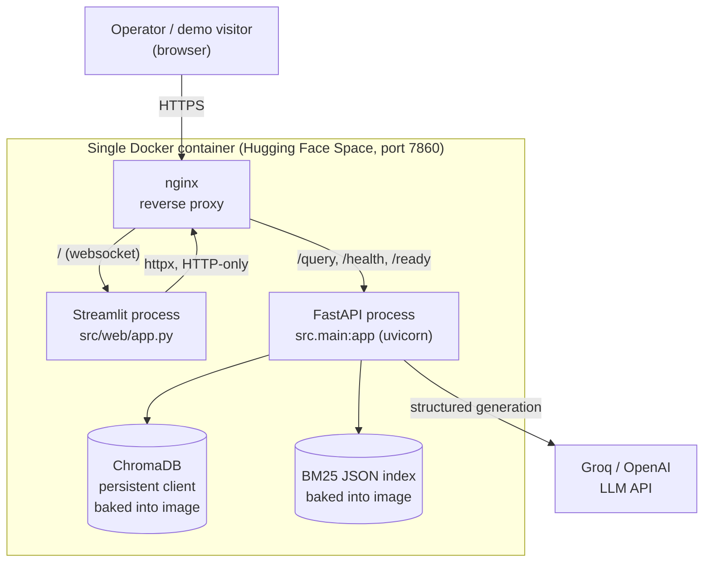
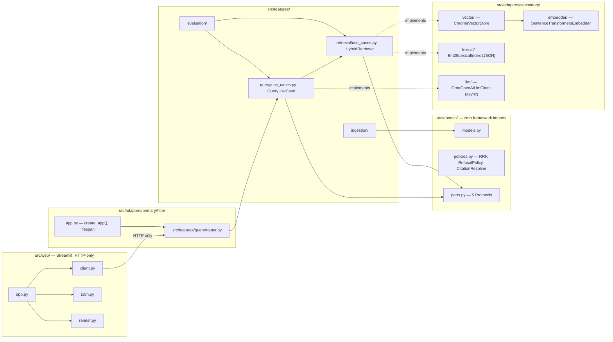
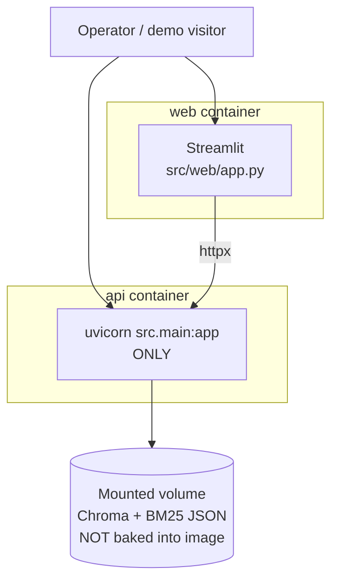

# Architecture — as-built (post-refactor) vs. target

This repo has already reached the target modular-monolith shape for
everything except the deploy container split (deferred — see ADR-005 and
the migration plan's Phase 4b appendix). The diagrams below reflect that:
"as-built" and "target" now differ only in the deploy layer.

## Container diagram — as-built (current, real)

## Component diagram — `src/` modular monolith (as-built)

## Deploy layer — target (Phase 4b, deferred)

Not implemented: blocked on choosing a deploy target that supports
multi-service compose and persistent volumes (today's HF Docker Space free
tier supports neither), per ADR-005.
